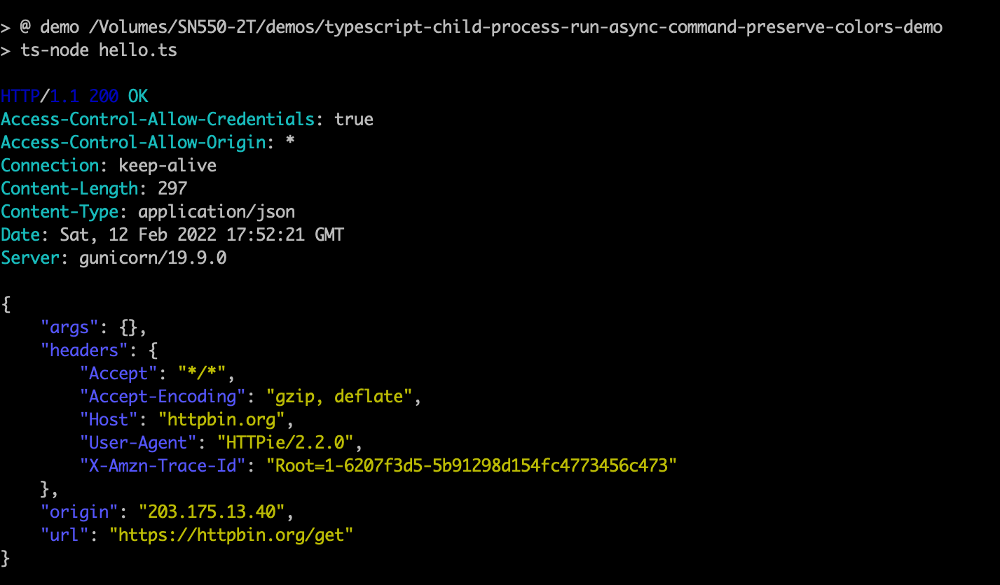

TypeScript Child Process Run Async Command Preserve Colors Demo
===========================

使用child_process调用命令，同时保持输出的颜色

直接使用`{stdio: 'inherit'}`作为`child_process`的options即可

```
npm install
npm run demo
```


